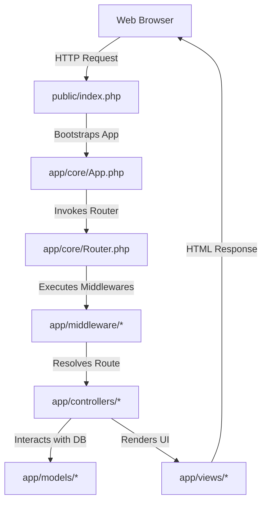

# 🧭 Codebase Index — Tamboli Samaj Portal

This document provides a complete map of the codebase, detailing the purpose and use case of every file and directory. It is designed to help new developers and AI agents understand the application architecture without scanning individual files.

---

## 🏛️ Architectural Flow

The application follows a standard Model-View-Controller (MVC) pattern with a front controller routing mechanism:

---

## 📁 Folder & File Catalog

Below is a detailed inventory of all directories and files in the repository.

### 1. 🎛️ Configurations (`app/config/`)

| File Path | Purpose / Description | Beginner-Friendly Explanation |
| :--- | :--- | :--- |
| [`app/config/app.php`](file:///c:/laragon/www/Tamoli-Prathibha-samman/app/config/app.php) | App configurations (name, URL, debug mode, and session details). | "Holds general settings like what name the portal displays and how long a user stays logged in." |
| [`app/config/constants.php`](file:///c:/laragon/www/Tamoli-Prathibha-samman/app/config/constants.php) | Defines core application variables extracted from environmental storage. | "Calculates whether we are in test mode or live mode based on environment settings." |
| [`app/config/database.php`](file:///c:/laragon/www/Tamoli-Prathibha-samman/app/config/database.php) | Database server connection configurations and query formatting rules. | "Contains database username/passwords and connection settings needed to talk to MySQL." |
| [`app/config/paths.php`](file:///c:/laragon/www/Tamoli-Prathibha-samman/app/config/paths.php) | Standardizes filesystem reference paths across the application. | "Stores paths so the website knows exactly where the templates and upload folders are located." |

---

### 2. 🛡️ Core Engine (`app/core/`)

| File Path | Purpose / Description | Beginner-Friendly Explanation |
| :--- | :--- | :--- |
| [`app/core/App.php`](file:///c:/laragon/www/Tamoli-Prathibha-samman/app/core/App.php) | The master bootstrapper. Starts sessions, configures error logs, and runs router. | "The primary spark plug. It wakes up the system, runs the security logs, and routes user actions." |
| [`app/core/ApplicationNumberGenerator.php`](file:///c:/laragon/www/Tamoli-Prathibha-samman/app/core/ApplicationNumberGenerator.php) | Generates short, unique IDs for student submissions (e.g. `SCH-2026-0004`). | "Generates neat tracking codes like `SCH-2026-X` so students can track their applications." |
| [`app/core/Auth.php`](file:///c:/laragon/www/Tamoli-Prathibha-samman/app/core/Auth.php) | User session manager wrapper. Checks user roles, logins, and credentials. | "Handles user logins, logouts, password-reset processes, and checks if a user is an admin." |
| [`app/core/Csrf.php`](file:///c:/laragon/www/Tamoli-Prathibha-samman/app/core/Csrf.php) | Generates and checks anti-hack security tokens for all forms. | "Ensures external malicious websites cannot force actions on behalf of logged-in users." |
| [`app/core/Database.php`](file:///c:/laragon/www/Tamoli-Prathibha-samman/app/core/Database.php) | Singleton database connector that maintains a single, active connection. | "Connects to your MySQL server once per page load and runs queries safely." |
| [`app/core/FileUploader.php`](file:///c:/laragon/www/Tamoli-Prathibha-samman/app/core/FileUploader.php) | Verifies file uploads using byte checks, renames them, and saves them. | "Ensures uploads are real images or PDFs, and stops hackers from uploading malicious scripts." |
| [`app/core/Flash.php`](file:///c:/laragon/www/Tamoli-Prathibha-samman/app/core/Flash.php) | Stores short messages in session memory that disappear on page reload. | "Displays notifications like 'Profile updated successfully!' that go away after one click." |
| [`app/core/Helpers.php`](file:///c:/laragon/www/Tamoli-Prathibha-samman/app/core/Helpers.php) | Utilities like sanitization wrappers to clean user inputs. | "Escapes characters (like converting `<` to `&lt;`) so users cannot inject malicious HTML code." |
| [`app/core/Input.php`](file:///c:/laragon/www/Tamoli-Prathibha-samman/app/core/Input.php) | Sanitizes and returns raw POST/GET variables securely. | "Cleans and reads parameters sent by the user in search bars or form inputs." |
| [`app/core/Logger.php`](file:///c:/laragon/www/Tamoli-Prathibha-samman/app/core/Logger.php) | Saves errors, exceptions, and audit events to files in storage. | "Acts as a security recorder, saving logs and error messages while hiding sensitive passwords." |
| [`app/core/Mailer.php`](file:///c:/laragon/www/Tamoli-Prathibha-samman/app/core/Mailer.php) | Integrates PHPMailer to send notifications and password resets. | "Talks to email servers (SMTP) to send confirmation messages and reset codes to users." |
| [`app/core/Pagination.php`](file:///c:/laragon/www/Tamoli-Prathibha-samman/app/core/Pagination.php) | Calculates offsets and breaks lists into multiple page blocks. | "Calculates numbers for page pagination (e.g. showing 1-20, 21-40) on listing screens." |
| [`app/core/Response.php`](file:///c:/laragon/www/Tamoli-Prathibha-samman/app/core/Response.php) | Manages headers, redirects, JSON arrays, and custom error pages. | "Sends responses back to the browser (like redirecting, sending JSON, or showing error pages)." |
| [`app/core/Router.php`](file:///c:/laragon/www/Tamoli-Prathibha-samman/app/core/Router.php) | Matchmaker class linking URL endpoints with controllers. Enforces middleware. | "Takes the URL you typed (like `/dashboard`) and sends it to the correct controller." |
| [`app/core/Session.php`](file:///c:/laragon/www/Tamoli-Prathibha-samman/app/core/Session.php) | Custom session handler configuring secure cookies and lifetimes. | "Saves information (like who is logged in) in the browser's cookie storage securely." |
| [`app/core/Validator.php`](file:///c:/laragon/www/Tamoli-Prathibha-samman/app/core/Validator.php) | Checks formats like valid emails, numbers, required fields, and bank IFSC rules. | "Validates form submissions (e.g. checks if a mobile number is 10 digits and IFSC code is valid)." |

---

### 3. 🚦 Routing Table (`app/routes/`)

| File Path | Purpose / Description | Beginner-Friendly Explanation |
| :--- | :--- | :--- |
| [`app/routes/web.php`](file:///c:/laragon/www/Tamoli-Prathibha-samman/app/routes/web.php) | Registration desk of the web application. Lists all routes. | "A directory list of all valid links on our website and which user roles are allowed to access them." |

---

### 4. 🕶️ Middlewares (`app/middleware/`)

| File Path | Purpose / Description | Beginner-Friendly Explanation |
| :--- | :--- | :--- |
| [`app/middleware/AdminMiddleware.php`](file:///c:/laragon/www/Tamoli-Prathibha-samman/app/middleware/AdminMiddleware.php) | Stops non-administrators from loading backend panels. | "Acts as a security guard at the admin dashboard gate, checking if you have admin credentials." |
| [`app/middleware/AuthMiddleware.php`](file:///c:/laragon/www/Tamoli-Prathibha-samman/app/middleware/AuthMiddleware.php) | Redirects unauthenticated web requests back to the login page. | "Ensures that you are logged in; otherwise, it sends you to the login screen." |
| [`app/middleware/GuestMiddleware.php`](file:///c:/laragon/www/Tamoli-Prathibha-samman/app/middleware/GuestMiddleware.php) | Redirects logged-in users away from auth pages like `/login` or `/register`. | "Keeps logged-in users from viewing the login or registration screens again." |
| [`app/middleware/RepresentativeMiddleware.php`](file:///c:/laragon/www/Tamoli-Prathibha-samman/app/middleware/RepresentativeMiddleware.php) | Restricts access to community representative views. | "A security gate protecting pages meant only for community representatives." |
| [`app/middleware/StudentMiddleware.php`](file:///c:/laragon/www/Tamoli-Prathibha-samman/app/middleware/StudentMiddleware.php) | Blocks admins or reps from attempting student tasks. | "Ensures only registered student profiles can apply for scholarships or edit qualifications." |

---

### 5. 🏗️ Controllers (`app/controllers/`)

| File Path | Purpose / Description | Beginner-Friendly Explanation |
| :--- | :--- | :--- |
| [`app/controllers/AdminAnnouncementController.php`](file:///c:/laragon/www/Tamoli-Prathibha-samman/app/controllers/AdminAnnouncementController.php) | Controller for creating, updating, and removing community announcements. | "Admin panel logic to publish, edit, or delete notices on the portal." |
| [`app/controllers/AdminApplicationController.php`](file:///c:/laragon/www/Tamoli-Prathibha-samman/app/controllers/AdminApplicationController.php) | Processes student submissions (approving, disputing, rejecting). | "Enables administrators to review applications, mark documents verified, or write feedback." |
| [`app/controllers/AdminSettingsController.php`](file:///c:/laragon/www/Tamoli-Prathibha-samman/app/controllers/AdminSettingsController.php) | Processes portal settings and creates/activates academic years. | "Controls the toggle to open or close applications and sets the current active year." |
| [`app/controllers/AdminUserController.php`](file:///c:/laragon/www/Tamoli-Prathibha-samman/app/controllers/AdminUserController.php) | Manages user directory actions (adding representatives, disabling users). | "Admin controller to delete spam accounts or register new community moderators." |
| [`app/controllers/ApplicationController.php`](file:///c:/laragon/www/Tamoli-Prathibha-samman/app/controllers/ApplicationController.php) | Student forms processing engine for Scholarships & Pratibha Samman awards. | "Validates, processes, and saves a student's applications and document uploads." |
| [`app/controllers/AuthController.php`](file:///c:/laragon/www/Tamoli-Prathibha-samman/app/controllers/AuthController.php) | Handles logging in, signup registrations, password recoveries, and resets. | "Manages registration forms, authenticates credentials, and emails password reset codes." |
| [`app/controllers/DashboardController.php`](file:///c:/laragon/www/Tamoli-Prathibha-samman/app/controllers/DashboardController.php) | Coordinates the welcome dashboards for Students, Admins, and Reps. | "Loads relevant summary figures and stats for your profile dashboard when you log in." |
| [`app/controllers/ErrorController.php`](file:///c:/laragon/www/Tamoli-Prathibha-samman/app/controllers/ErrorController.php) | Coordinates error views for status codes (401, 403, 404, 500). | "Catches problems and presents a neat, polite error page instead of raw code errors." |
| [`app/controllers/HomeController.php`](file:///c:/laragon/www/Tamoli-Prathibha-samman/app/controllers/HomeController.php) | Handles the public landing page and search-by-reference forms. | "Loads the public homepage where anyone can check their application status." |
| [`app/controllers/ProfileController.php`](file:///c:/laragon/www/Tamoli-Prathibha-samman/app/controllers/ProfileController.php) | Manages student profile pages and image-cropped photo uploads. | "Handles editing student names, contact details, and cropping profile photos." |

---

### 6. 🗃️ Models (`app/models/`)

| File Path | Purpose / Description | Beginner-Friendly Explanation |
| :--- | :--- | :--- |
| [`app/models/AcademicSession.php`](file:///c:/laragon/www/Tamoli-Prathibha-samman/app/models/AcademicSession.php) | Manages settings and status of academic years in the database. | "Helps fetch, add, or set active year sessions in the database." |
| [`app/models/Application.php`](file:///c:/laragon/www/Tamoli-Prathibha-samman/app/models/Application.php) | Model handling complex MySQL joins and updates for student forms. | "Reads/writes all application forms, bank codes, and uploaded document references." |
| [`app/models/ApplicationStatus.php`](file:///c:/laragon/www/Tamoli-Prathibha-samman/app/models/ApplicationStatus.php) | Database model for the status lookup names. | "Helps match status IDs (like 1, 2) to names (like 'Pending', 'Approved')." |
| [`app/models/ApplicationType.php`](file:///c:/laragon/www/Tamoli-Prathibha-samman/app/models/ApplicationType.php) | Database model for application type identifiers. | "Distinguishes between 'Scholarship' and 'Pratibha Samman' entries in the database." |
| [`app/models/Student.php`](file:///c:/laragon/www/Tamoli-Prathibha-samman/app/models/Student.php) | Represents student details. Protects columns from injection attacks. | "Handles reading and updating profile details like address and phone numbers." |
| [`app/models/User.php`](file:///c:/laragon/www/Tamoli-Prathibha-samman/app/models/User.php) | Represents credentials, security masks, and verification status in database. | "Communicates with the user credentials table to toggle permissions or delete logs." |

---

### 7. 🎨 Layouts & Views (`app/views/`)

*All UI pages are split into feature folders under `app/views/` and are rendered using standard PHP templates.*

* **Layouts (`app/views/layouts/`)**:
  - `header.php` / `footer.php`: Global HTML start/end wrappers with CSS assets, canonical URLs, robots meta rules, Open Graph tags, and standard styling.
  - `admin-header.php` / `admin-sidebar.php`: Administrative navigation layouts.
  - `student-sidebar.php`: Dashboard sidebar for students.
  - `flash-message.php`: Template for displaying dismissible success/error notification banners.
  - `navbar.php`: Top bar links with language switches and profile menus.
* **Feature Views**:
  - `admin/`: Sub-folders for announcements management, review tables, settings configuration, and student/representative lists.
  - `applications/`: HTML forms for scholarship and Pratibha Samman submission.
  - `auth/`: Login, signup, password-reset request, and password-reset submit forms.
  - `dashboard/`: Dashboards for students (recent uploads), administrators (metrics overview), and representatives.
  - `errors/`: Custom error layouts (401 Unauthorized, 403 Forbidden, 404 Not Found, 500 Server Error).
  - `home/`: Public landing page and tracker views.
  - `profile/`: Student profile view and edit tabs.

---

### 8. 🗄️ Database & Schema (`database/`)

| File Path | Purpose / Description | Beginner-Friendly Explanation |
| :--- | :--- | :--- |
| [`database/schema/001_create_tables.sql`](file:///c:/laragon/www/Tamoli-Prathibha-samman/database/schema/001_create_tables.sql) | Wrote all 11 core tables and Delight Auth tables in SQL script. | "The master recipe book containing the table layouts and initial setup settings." |
| [`database/setup.php`](file:///c:/laragon/www/Tamoli-Prathibha-samman/database/setup.php) | The command-line program that installs the database and creates default admins. | "An automated setup installer script. Run this in your terminal to build your database." |

---

### 9. 🌐 Web Access Portals (`public/`)

| File Path | Purpose / Description | Beginner-Friendly Explanation |
| :--- | :--- | :--- |
| [`public/index.php`](file:///c:/laragon/www/Tamoli-Prathibha-samman/public/index.php) | Master entry point. Loads environmental files and handles bootstrap. | "The front door of the website. Every web request passes here first to boot up the system." |
| `public/.htaccess` | Security parameters, headers, and rewrite directives for Apache. | "Blocks unauthorized file scans and forces the browser to load pages securely." |
| `public/favicon.png` | Community Samaj icon for bookmarks and browser tabs. | "The tiny community logo shown on your browser tab." |
| `public/uploads/` | Dynamic storage path for photos and files. Safe-guarded by `.htaccess`. | "Holds uploaded photos and marksheet documents in secure, non-executable folders." |
| `public/assets/` | Folder containing CSS styles, JS files, and local illustrations. | "Holds all styling codes (CSS), script plugins (JS), and images used on the UI." |

---

## 🤖 Instructions for AI Agents

When editing this codebase, you **must** adhere to the following rules:

1. **Keep Controllers Lean**: Business logic must reside in models or helpers where appropriate. Do not bloat controller files with database raw execution arrays.
2. **Strict Type Safety**: Endorse `declare(strict_types=1);` at the top of every PHP file.
3. **Escaping Output**: Always wrap dynamic user outputs in views with `\App\Core\Helpers::esc()`.
4. **Whitelists on Updates**: If modifying model update actions, always whitelist keys in the update array (refer to [`Student::update`](file:///c:/laragon/www/Tamoli-Prathibha-samman/app/models/Student.php) or [`Application::update`](file:///c:/laragon/www/Tamoli-Prathibha-samman/app/models/Application.php)).
5. **CSRF Enforcement**: If creating a new POST/PUT action, ensure a CSRF verification token check is called first in the controller.
