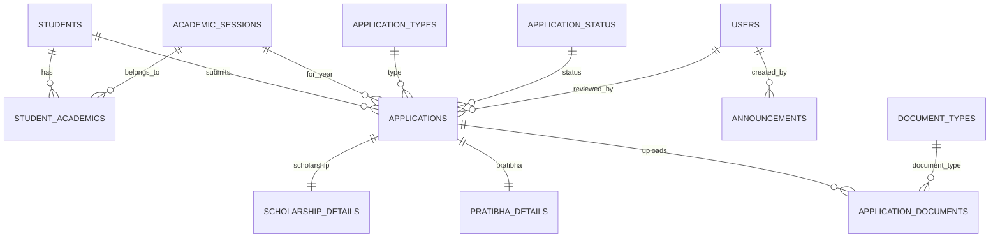

# Tamboli Samaj Portal — Final V1 Database Schema (Frozen)

**Stack:** PHP 8.3 + MySQL 8 + Bootstrap 5 + Hostinger
**Architecture Goal:** Simple, maintainable, reusable for 10+ years
**Total Tables: 11** (simplified from 12)
- Removed `scholarship_details` table
- Removed `pratibha_details` table
- Merged all fields into single `applications` table
- Use ENUM type to differentiate application type
- NULL columns are safe for small dataset

---

# ER Diagram



---

# 1. users

Admin accounts only.

| Column        | Type                                         |
| ------------- | -------------------------------------------- |
| id            | BIGINT UNSIGNED PK                           |
| name          | VARCHAR(100)                                 |
| email         | VARCHAR(150)                                 |
| password_hash | VARCHAR(255)                                 |
| role          | ENUM('super_admin','admin','representative') |
| status        | TINYINT                                      |
| created_at    | DATETIME                                     |
| updated_at    | DATETIME                                     |

### Unique

```text
email
```

---

# 2. students

Permanent student profile.

Student fills once.

| Column        | Type                  |
| ------------- | --------------------- |
| id            | BIGINT UNSIGNED PK    |
| student_code  | VARCHAR(30)           |
| first_name    | VARCHAR(100)          |
| last_name     | VARCHAR(100)          |
| gender        | ENUM('Male','Female') |
| dob           | DATE                  |
| mobile        | VARCHAR(20)           |
| email         | VARCHAR(150)          |
| father_name   | VARCHAR(120)          |
| mother_name   | VARCHAR(120)          |
| address       | TEXT                  |
| city          | VARCHAR(100)          |
| district      | VARCHAR(100)          |
| state         | VARCHAR(100)          |
| pincode       | VARCHAR(10)           |
| profile_photo | VARCHAR(255) NULL     |
| created_at    | DATETIME              |
| updated_at    | DATETIME              |

### Unique

```text
student_code
mobile
```

---

# 3. academic_sessions

Examples:

* 2025-26
* 2026-27

| Column       | Type               |
| ------------ | ------------------ |
| id           | BIGINT UNSIGNED PK |
| session_name | VARCHAR(20)        |
| is_active    | TINYINT            |

### Unique

```text
session_name
```

---

# 4. student_academics

Year-wise academic details.

| Column           | Type               |
| ---------------- | ------------------ |
| id               | BIGINT UNSIGNED PK |
| student_id       | BIGINT UNSIGNED FK |
| session_id       | BIGINT UNSIGNED FK |
| course_name      | VARCHAR(100)       |
| class_year       | VARCHAR(50)        |
| college_name     | VARCHAR(150)       |
| board_university | VARCHAR(150)       |
| marks_obtained   | DECIMAL(8,2)       |
| max_marks        | DECIMAL(8,2)       |
| percentage       | DECIMAL(5,2)       |
| created_at       | DATETIME           |

### Unique

```text
(student_id, session_id)
```

---

# 5. application_types

Rows:

* Scholarship
* Pratibha Samman

| Column | Type               |
| ------ | ------------------ |
| id     | BIGINT UNSIGNED PK |
| name   | VARCHAR(50)        |

---

# 6. application_status

**Simplified Status Model**

Rows:

* Pending
* Approved
* Rejected
* Disputed

| Column | Type               |
| ------ | ------------------ |
| id     | BIGINT UNSIGNED PK |
| name   | VARCHAR(50)        |

---

# 7. applications

**Simplified:** Single table with flexible columns for both Scholarship and Pratibha applications.

| Column               | Type                    |
| -------------------- | ----------------------- |
| id                   | BIGINT UNSIGNED PK      |
| student_id           | BIGINT UNSIGNED FK      |
| session_id           | BIGINT UNSIGNED FK      |
| application_type_id  | BIGINT UNSIGNED FK      |
| status_id            | BIGINT UNSIGNED FK      |
| reviewed_by          | BIGINT UNSIGNED NULL FK |
| dispute_message      | TEXT NULL               |
| submitted_at         | DATETIME                |
| created_at           | DATETIME                |
| updated_at           | DATETIME                |
| type                 | ENUM('scholarship','pratibha') |
| family_income        | DECIMAL(12,2) NULL      |
| bank_name            | VARCHAR(100) NULL       |
| account_number       | VARCHAR(30) NULL        |
| ifsc_code            | VARCHAR(20) NULL        |
| achievement_title    | VARCHAR(200) NULL       |
| achievement_category | VARCHAR(100) NULL       |
| achievement_level    | VARCHAR(100) NULL       |
| rank_position        | VARCHAR(50) NULL        |

---

**Note:** All scholarship and pratibha fields are in ONE table now. No separate tables.

---

# 8. document_types

Rows:

* Aadhaar
* Marksheet
* Photo
* Passbook
* Certificate

| Column | Type               |
| ------ | ------------------ |
| id     | BIGINT UNSIGNED PK |
| name   | VARCHAR(100)       |

---

# 9. application_documents

Stores uploaded files.

| Column              | Type                                  |
| ------------------- | ------------------------------------- |
| id                  | BIGINT UNSIGNED PK                    |
| application_id      | BIGINT UNSIGNED FK                    |
| document_type_id    | BIGINT UNSIGNED FK                    |
| original_name       | VARCHAR(255)                          |
| stored_name         | VARCHAR(255)                          |
| mime_type           | VARCHAR(100)                          |
| file_size           | BIGINT                                |
| verification_status | ENUM('pending','verified','rejected') |
| uploaded_at         | DATETIME                              |

### Indexes

```text
application_id
document_type_id
```

---

# 10. announcements

Admin announcements.

| Column     | Type               |
| ---------- | ------------------ |
| id         | BIGINT UNSIGNED PK |
| title      | VARCHAR(200)       |
| slug       | VARCHAR(255)       |
| content    | LONGTEXT           |
| is_active  | TINYINT            |
| created_by | BIGINT UNSIGNED FK |
| created_at | DATETIME           |

### Unique

```text
slug
```

---

# 11. settings

Simple key-value store for portal settings.

| Column     | Type               |
| ---------- | ------------------ |
| id         | BIGINT UNSIGNED PK |
| key        | VARCHAR(100)       |
| value      | TEXT               |
| updated_at | DATETIME           |

### Unique

```text
key
```

**Example rows:**

```
key: scholarship_open, value: 1
key: pratibha_open, value: 1
key: current_session_id, value: 1
key: site_name, value: Tamboli Samaj Portal
key: contact_email, value: admin@tamoli.org
```

---

# Foreign Keys Summary

### student_academics
- student_id → students.id
- session_id → academic_sessions.id

### applications
- student_id → students.id
- session_id → academic_sessions.id
- application_type_id → 
### pratibha_details
- application_id → applications.id

### application_documents
- application_id → applications.id
- document_type_id → document_types.id

### announcements
- created_by → users.id
### Student profile duplication

```text
UNIQUE(mobile)
```

### Academic duplication

```text
UNIQUE(student_id, session_id)
```

### Application duplication

```text
UNIQUE(student_id, session_id, application_type_id)
```

This allows:

✅ Scholarship + Pratibha in same year

✅ Same student every year

❌ Same scholarship twice in one year

---

# Future Expansion

Add later without changing current tables:

* members
* events
* donations
* blood_donors
* volunteers

No redesign required.

---

# Final Recommendation

**Freeze this schema and start building.**

Further database redesign will provide little benefit compared to improving:

1. Forms
2. Validation
3. Mobile UI
4. Admin dashboard
5. Document upload UX
6. Volunteer usability
